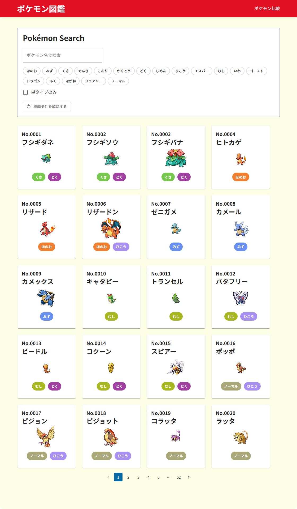

# Poke Index

ポケモンを検索・フィルタできる図鑑アプリです。
React + TypeScript + Vite を用いて開発しました。

## URL

https://poke-index-six.vercel.app/

## 制作背景

ポケモンが好きで、[ポケモンAPI](https://pokeapi.co/)の存在を知ったことをきっかけに、これを活用した図鑑アプリを開発しました。

また、ReactにおけるAPI連携や状態管理の理解を深めることも目的としています。

## 技術スタック

- React
- TypeScript
- Vite
- MUI

## ✨ 主な機能

- ポケモン一覧表示（日本語対応）
- 名前検索
- タイプフィルター
- 詳細表示
- 画像の色違いの切り替え表示
- ページネーション
- ポケモンの比較機能
- ローカルストレージによるお気に入り機能

## データ設計

- `scripts/generatePokemonJa.ts` により、[ポケモンAPI](https://pokeapi.co/)からデータを取得し、日本語化したJSONを生成
- アプリ側では生成済みのJSONを利用することで、API呼び出しを削減し、表示パフォーマンスを改善

## 工夫した点

- 検索・フィルタ・ページネーションを組み合わせた際に発生する状態不整合（ページ番号が保持される問題）を修正し、UXを改善
- APIデータとローカルデータの役割を整理し、表示用データとして構築することで状態管理を簡素化
- 一覧表示ではローカルJSONを活用し、API依存を減らすことで表示速度と安定性を改善
- 日本語表示に対応するため、APIレスポンスとローカルデータを統合し、ユーザーにとって直感的なUIを実現
- 詳細画面では通常色と色違いの切り替えを実装し、視覚的な楽しさを向上
- UIでは視認性を考慮し、カードデザインやドロップシャドウを調整

## 今後の課題

- 一覧表示にメガシンカ・フォルム違い・リージョンフォームを表示する
- ローディング・エラー状態のUI改善
- パフォーマンス最適化

## 更新情報

### 2026-08-18
- [アンノーン](https://poke-index-six.vercel.app/pokemon/201)のフォルム情報表示機能を追加
- [ポワルン](https://poke-index-six.vercel.app/pokemon/351)のフォルム情報表示機能を追加
- [ミノムッチ](https://poke-index-six.vercel.app/pokemon/412)のフォルム情報表示機能を追加
- [ミノマダム](https://poke-index-six.vercel.app/pokemon/413)のフォルム情報表示機能を追加
- [チェリム](https://poke-index-six.vercel.app/pokemon/421)のフォルム情報表示機能を追加

### 2026-08-19
- [デオキシス](https://poke-index-six.vercel.app/pokemon/386)のフォルム情報表示機能を追加
- [カラナクシ](https://poke-index-six.vercel.app/pokemon/422)のフォルム情報表示機能を追加
- [トリトドン](https://poke-index-six.vercel.app/pokemon/423)のフォルム情報表示機能を追加
- メガシンカの情報表示機能を追加

### 2026-08-20
- フォルム違いの情報を取得（ステータスに変化の無いポケモンを対象）

### 2026-09-03
- バージョン違いの情報を取得（ステータスが変化するポケモンを対象）

### 2026-09-04
- 詳細画面のリージョンフォームから各リージョンフォーム詳細に遷移するように実装
- 細かいバグの修正

### 2026-09-08
- 詳細画面のメガシンカから各メガシンカ詳細に遷移するように実装
- 詳細画面のフォルムから各フォルム詳細に遷移するように実装
- ポケモンの表示名を姿やフォルムを含めて表示するように修正

### 2026-09-10
- お気に入り機能を追加
  - ローカルストレージにお気に入りのポケモンIDを保存
  - 詳細画面からお気に入りの登録、解除をトグル形式で実装
  - 一覧画面にお気に入りのみ表示するフィルターを追加

### 2026-09-24
- 画面一覧に以下のデータを追加
  - メガシンカ
  - ダイマックス
  - リージョンフォーム
  - フォルム違い

## GitHub

https://github.com/plugout007/poke-index
